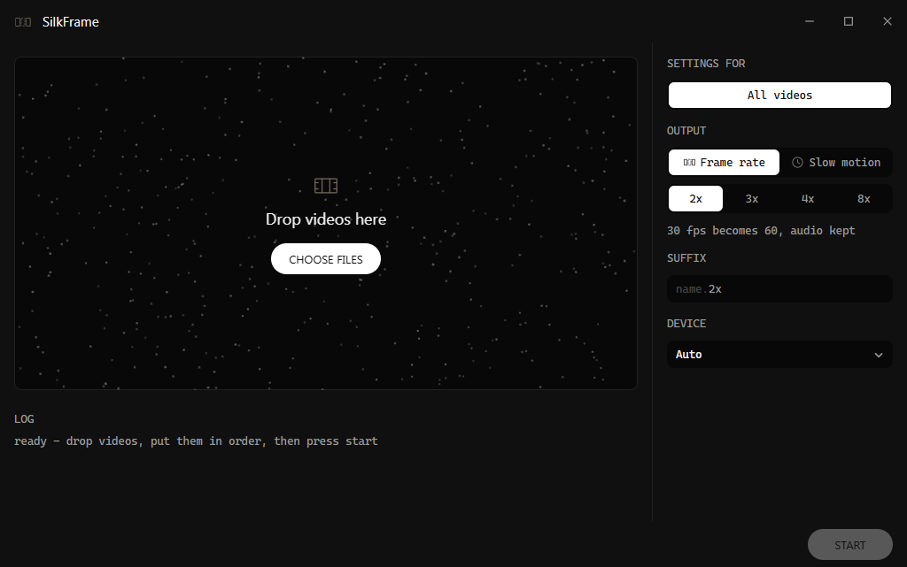

# SilkFrame

Multiplies the frames of any video by synthesising new frames between the pairs
of existing ones, using RIFE v4.25.



```
python gui.py                                  # drag and drop window
python silkframe.py clip.mp4                   # 30 fps -> 60 fps, same length, audio kept
python silkframe.py clip.mp4 --factor 4        # 30 fps -> 120 fps
python silkframe.py clip.mp4 --target-fps 60   # 23.976 fps -> exactly 60
python silkframe.py clip.mp4 --mode slowmo     # 30 fps, half speed, twice as long
```

Everything ffmpeg can decode goes in, the weights download themselves on first
run, and memory use stays flat no matter how long the video is.

## Install

```
pip install torch --index-url https://download.pytorch.org/whl/cu128   # or the cpu build
pip install -r requirements.txt
```

ffmpeg and ffprobe must be on PATH (5.1 or newer). A CUDA GPU is optional but
worth having: on the test machine 720p ran at 88 ms per frame against 1486 ms
on the CPU. The first run downloads a 23 MB checkpoint to `~/.cache/silkframe`
(override with `SILKFRAME_CACHE`). `python selftest.py` checks the install end
to end.

## The window

`python gui.py` (or `pythonw gui.py` for no console) opens a drop target. Drop
one or more videos and they line up in it, one row each, in the order they will
run; drag a row to move it, click the cross to drop it, and press start when the
order is right. Each file is written beside its source, as `name.4x.mp4` or
`name.slowmo.mp4`, after whatever the sidebar was set to when the file was
added - or after the suffix typed there, if one was. The sidebar picks the
mode, how many frames come out per frame in, the suffix and which device does
the work, and it is set either to all of the videos or to one of them. On All
videos, whatever is changed there is changed for every waiting file and for the
ones added next, and only that: setting the factor for all of them leaves each
one's own suffix where it was. Click a row and the sidebar names that file and
brings up its own settings instead, so a single queue can hold a 2x pass, a 4x
on the GPU and an 8x slow motion at once; click the row again, or All videos,
to go back. The file being worked on keeps what it started with either way. The
device list fills itself a second or two after the window opens, because naming
the GPUs means loading torch. Files run one at a time, more can be dropped and
the ones still waiting reordered while a job is running, and a file that fails
is logged and the rest carry on.
Stop is the pair to start: the file being worked on is abandoned and goes back
to the head of the line, everything behind it keeps its place, and start picks
the same order back up. The front end is plain HTML, CSS and JavaScript in
`web/`, rendered by pywebview in a native window.

## How it works

ffmpeg decodes to raw RGB down a pipe on a reader thread, so decoding overlaps
with inference, and rotated phone video arrives upright. Each frame is uploaded
to the GPU once and reused as both halves of consecutive pairs. Two cheap tests
skip the network entirely: repeated frames stay duplicated rather than blurred
together, and across a shot change the previous frame is repeated rather than
morphed into the next scene. Otherwise RIFE estimates bidirectional flow and
blends the two warped frames with a learned mask. Original frames pass through
to the encoder byte for byte and the audio is copied, not re-encoded. Precision
is chosen by timing both at startup, because fp16 is a large win on GPUs with
tensor cores and a large loss on those without them.

## Quality

`benchmark.py` hides the middle frame of consecutive triplets, rebuilds it from
its two neighbours and compares it with the frame that was really there. Mean
PSNR/SSIM over 25 triplets per clip, 720p:

| method | Sintel (fast, hard) | Big Buck Bunny | Jellyfish |
| --- | --- | --- | --- |
| repeat previous frame | 20.58 dB / 0.875 | 32.43 dB / 0.912 | 26.92 dB / 0.889 |
| cross-fade both frames | 22.97 dB / 0.889 | 36.76 dB / 0.954 | 31.30 dB / 0.927 |
| **RIFE 4.25** (default) | **26.50 dB / 0.923** | **37.14 dB / 0.972** | **37.50 dB / 0.982** |

The other four checkpoints (`4.26`, `4.25.heavy`, `4.26.heavy`, `4.25.lite`)
land within a few hundredths of a dB of the default, at up to 55% more time per
frame; the choice between them matters far less than the 3–6 dB they all gain
over a cross-fade. Reproduce with `python benchmark.py your.mp4 --models all`.

## Options

| flag | default | notes |
| --- | --- | --- |
| `--mode fps\|slowmo` | `fps` | `fps` raises the rate and keeps the audio; `slowmo` stretches the running time and drops it |
| `--factor`, `-f` | `2` | frames out per frame in; `3` and `4` are the useful ones, `8` works |
| `--target-fps` | off | an exact rate instead of a whole multiple: `60`, `59.94`, `60000/1001`. fps mode only |
| `--model` | `4.25` | `4.26`, `4.25.heavy`, `4.26.heavy`, `4.25.lite` |
| `--scale` | `1.0` | `0.5` for 4K or when memory is tight, `2.0` for small frames or very slow motion |
| `--device` | `auto` | `auto` takes the GPU with the most free memory; also `cuda`, `cuda:1`, `mps`, `cpu` |
| `--list-devices` | | print what torch can see here, then exit |
| `--threads` | `0` | torch CPU threads; only bites on `--device cpu` |
| `--fp32` | auto | force full precision instead of the timed choice |
| `--start`, `--duration` | whole file | seconds or `HH:MM:SS`; render ten seconds to try settings out before committing to the whole clip. The copied audio starts on a packet boundary, so it can begin a frame or two off |
| `--encoder`, `--crf`, `--preset`, `--pix-fmt` | `libx264`, `17`, `slow`, `yuv420p` | `--encoder h264_nvenc` for the GPU encoder |
| `--no-audio` | off | drop the audio track |
| `--no-overwrite` | off | stop rather than replace an output that is already there |
| `--scene-threshold` | `0.35` | `0` interpolates across cuts too |
| `--still-threshold` | `0.001` | `0` interpolates repeated frames too |

## Limits worth knowing

- **Every new frame is guessed from the same two real ones.** At 4x the three
  frames in a gap all come from one pair, so wherever the flow is wrong it
  stays wrong for three frames instead of one. 2x and 3x are the safe
  multiples; look at the result before trusting 8x.
- **Trimming needs a container ffmpeg can seek in.** `--start` and `--duration`
  rest on ffmpeg's seek, which works in mp4, mkv and mov but not in a raw `.ts`
  transport stream: trimming one decodes nothing and stops with a message. The
  same file processes fine whole.
- **A target rate below the source rate drops frames.** `--target-fps` places
  output frames on the source's timeline, so asking 60 fps footage for 30 picks
  every other frame rather than blending them. It warns when it does this.
- **Variable frame rate in, constant out.** The output rate is built from the
  source's *average* rate - or, when `--start` or `--duration` narrows it, from
  the measured rate of just that span, since a file-wide average says nothing
  about one stretch of a VFR clip. Running time and audio sync are preserved
  either way. Every frame is kept, but the timing wobble is evened out.
- **8-bit.** Frames travel as RGB24, so 10-bit and HDR sources lose bit depth.
  The primaries, transfer curve and range are copied, so nothing shifts hue.
- **Odd frame sizes** cannot be stored in yuv420p, so those clips are encoded as
  yuv444p instead.
- **4K needs 4.4 GiB** for a frame pair and collapses to 0.1 fps on a 6 GB card.
  `--scale 0.5` estimates flow at half resolution — output stays full — and
  brought the same clip back to 1.8 fps. This is measured at startup and warned
  about.

## Building something to hand over

`build.bat` packages everything with PyInstaller into `dist\SilkFrame\` and zips
it; `build.bat nozip` skips the slow zip step while iterating. Whoever you give
it to unzips it and runs `SilkFrame.exe` — no Python, no ffmpeg, no model
download, because all three are inside. Expect it to be large, nearly all of it
the CUDA half of PyTorch; building from a CPU-only venv gives a fraction of the
size and still runs anywhere, just slowly. Windows shows a SmartScreen warning
for an unsigned executable — More info, then Run anyway.

## Credits

RIFE is by Huang et al. (ECCV 2022), and the checkpoints are the official
[Practical-RIFE](https://github.com/hzwer/Practical-RIFE) releases, downloaded
from the mirror published by [vs-rife](https://github.com/HolyWu/vs-rife). The
network here is an inference-only port of their `IFNet_HDv3`; the weights are
loaded unmodified.
